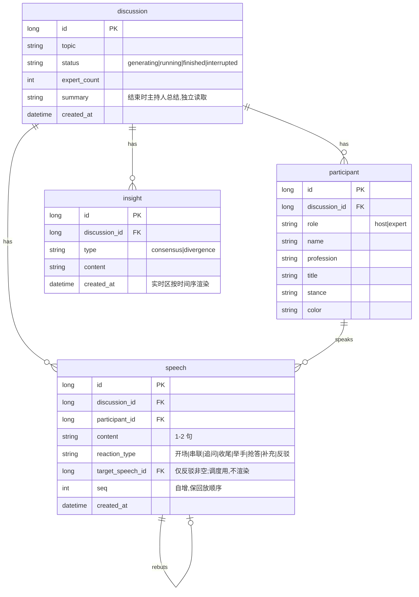

# AI 圆桌讨论 MVP · 头脑风暴结论(BRAINSTORM)

> 本文是「AI Panel Studio」MVP 需求澄清阶段(引导阶段)的收敛结论,作为后续 SDD(数据/API 契约)、DDD(前端设计)、TDD(核心逻辑测试)的唯一事实源。
> 一句话架构:**后端是唯一引擎,自驱多个讨论并行推进、写库、SSE 广播;前端是纯观察者,不驱动任何讨论逻辑。**

---

## 一、MVP 功能边界

### 必须做(7 项功能要求,一项不删)
1. 首页:讨论列表 + 发起新讨论 + 点进去观察
2. 输入话题 + 专家人数(默认 4)→ AI 生成主持人 + 专家阵容(名/职/Title/立场/专属色)→ 用户确认
3. 演播厅:主持人开场/追问/串联/总结 + 专家非机械发言(每次 1–2 句)
4. 专家状态小窗(待机/准备发言/发言中 + 公开关注点,**不露真实 CoT**)
5. 实时共识/分歧(边讨论边更新,**不等结束**)
6. 现场 Transcript(姓名/Title + 色块;**不显示"举手"等内部事件**)
7. 结束时主持人自然语言总结(**不露 JSON 原文**)

### 明确不做(YAGNI 已砍)
| 砍除项 | 理由 |
|---|---|
| 多用户/账号/登录 | 本地 App,"加入观察" = 打开该讨论页订阅其 SSE 流,无需 auth/用户表 |
| 中途人工干预(插话/投票/踢人) | 文档未要求,纯观看 |
| 讨论暂停/继续/编辑阵容 | 生成→确认→跑完一条直线,中途控制是复杂度黑洞 |
| 专门录制/导出 | 只在用户画像出现;SQLite 存了 transcript 天然可回看 |
| PWA / 移动手势 | 只做响应式,不做 App 化 |

### 保留的硬约束
- **断点续看**:打开已有讨论 = 先从 SQLite 加载历史(transcript/共识/分歧)→ 再续订 SSE 实时流。
- **三档响应式**(超宽/桌面/窄屏合理分配区域)是打分项,认真做;各区域独立滚动,不靠整页滚动。
- **前端一次专注一个讨论**,通过列表切换;同屏多路观看属过度设计,不做。

---

## 二、核心实体与数据模型(SDD 骨架)

**4 张表**(合并策略:主持人/专家共用 `participant` 靠 `role` 区分;共识/分歧合并 `insight` 靠 `type` 区分;不建 `event` 表)。



### 落库 vs 内存(关键切分)
- **落库(耐久结果)**:`speech`、`insight`、`discussion.summary`、阵容 `participant`。
- **内存 + 快照(瞬时状态)**:每位专家的 `status`(待机/准备/发言中)与 `focus`(公开关注点)。后端引擎在内存持有每讨论当前状态;新 SSE 连接接入时先推 `snapshot` 事件再接实时流,解决"中途加入看到空白小窗"。**不建历史状态表。**
- **不建 `event` 表**:事件流隔离靠"每讨论一个内存通道 + 独立 SSE"实现;`reaction_type`/`target_speech_id` 只做调度与小窗,不作为文字进 transcript。

---

## 三、实时机制:SSE(SseEmitter)

**技术栈:Spring Boot + MyBatis-Plus + SQLite。**

### 为何 SSE 完胜 WebSocket(本项目语境)
1. **数据流单向**(引擎 → 前端,前端从不回传)→ WebSocket 双向能力 100% 浪费,SSE 天生"服务器单向推"。
2. **原生自动重连**(`EventSource`)贴合"加入/续看"。
3. **更懒**:纯 HTTP、穿代理无坑;`SseEmitter` 是 Spring 原生,零额外依赖。

### 连接与事件
- 连接粒度:`GET /discussions/{id}/stream` 返回一个 `SseEmitter`;每讨论一组 emitter,支持多观众同看。
- **6 种命名事件**:

| event | 何时推 | payload 要点 | 前端动作 |
|---|---|---|---|
| `snapshot` | 新连接接入 | 当前每位专家 status+focus、当前发言人 | 初始化小窗 |
| `speech` | 有新发言 | speech 行(含 seq) | 追加 transcript |
| `insight` | 提炼出共识/分歧 | insight 行(含 created_at) | 更新实时区 |
| `status` | 专家状态变化 | `{participantId, status, focus}` | 更新小窗(focus 并入,不单开事件) |
| `summary` + `finished` | 讨论收尾 | 自然语言 summary | 显示总结、停流 |
| `error` | AI 调用失败 | `{message}` | 亮错误态 + 提示重试 |

> 注:本表把 `summary` 与 `finished` 合为一行(收尾语境)故计 **6 种**;**最终实现将二者拆为两个独立事件、共 7 种**,以 `docs/API.md` §2 与 `docs/architecture.md` §6 为准。

### 三个经典坑的封堵
- **断线续看**:重连 = 重新 REST 拉历史 + 重新 `snapshot`,**砍掉 Last-Event-ID 事件重放**与内存事件历史。前端用 `speech.seq` / `insight.created_at` 对"历史 + 实时"去重排序,消除"拉历史↔接流"竞态。
- **保活**:`SseEmitter` 长超时 + 每 ~20s 发 `:ping` 注释心跳防代理掐连接。
- **死连接泄漏**:注册 `onCompletion/onTimeout/onError`,断开即从该讨论 emitter 列表移除,防泄漏与向死连接推送。

---

## 四、多讨论并行:状态与事件流隔离

### 核心抽象:`DiscussionSession`(内存态,每讨论一个)
```
DiscussionSession {
  discussionId
  emitters : CopyOnWriteArrayList   // 该讨论观众连接(读多写少)
  liveState                         // 当前发言人 + 每位专家 status/focus(snapshot 数据源)
  // 讨论推进循环在这里跑
}
```

### 隔离 = 一个注册表按 id 分桶
```
ConcurrentHashMap<Long, DiscussionSession>   // discussionId -> session
```
**Map 的 key 就是隔离边界**,不需要消息中间件/topic 路由。

### 并发模型
- 每个"正在跑"的讨论 = 提交给**有界线程池**的一个长任务:`定发言人 → 调 Deepseek → 写 speech → 广播 → (主持人回合)提炼 insight → 循环`,直到终止。
- **并发上限 3**(`application.yml` 可配)+ 排队:防线程爆炸,双保险护住 ¥10 预算。

### 状态机与单写者纪律
- 状态流转:`generating → running → finished`(或 `interrupted`)。
- **单写者**:`generating` 阶段由请求线程写 `status`;**"用户确认 → 提交 loop"是交接点**;`running` 起由该 session 的引擎线程**独占**写 `status`/`liveState`。任何时刻无双写。
- **重启处理**:启动时把残留 `running` 讨论标 `interrupted`,前端显"已中断",历史 transcript 照常可看;崩溃恢复(续跑)列入 README 后续改进。
- **SQLite 开 WAL**(`PRAGMA journal_mode=WAL`):多引擎线程写 + 请求线程读同库文件,读不阻塞写。

---

## 五、发言调度:非机械轮流(核心考察点)

**混合模式:内容驱动选人 + Java 硬规则护栏。**

### 谁说下一个 —— 内容相关性驱动(非机械)
- "选谁"由 LLM 基于 transcript 内容判定(谁对最新发言最有话讲:支持/补充/反驳),**不是** Java 按候选名单轮流。
- Java 只负责:硬规则校验 + 防退化,**不决定人选**。

### Java 硬规则(可见的调度逻辑)
- 不允许同一专家连说两次(唯一例外:`补充` 自己上一句);
- `反驳` 必须指向一条已存在的 `speech`(`target_speech_id` 有效),否则判非法;
- 主持人节奏计数器:开场固定首发 → 每 ~3–4 条专家发言插一次(串联/追问)→ 上限收尾;
- 每次发言 1–2 句:prompt 约束 + Java 软校验超长截断。

### 四种反应类型 = 内部元数据(不渲染进 transcript)
| 类型 | 调度含义 | 小窗驱动 |
|---|---|---|
| 举手 | 默认排队 | 准备发言 |
| 抢答 | 高紧迫,插队队首 | 准备发言(高亮) |
| 补充 | 延续自己/盟友上一点 | 允许"连说"的唯一例外 |
| 反驳 | 必须 target 一条已有 speech | Java 校验 target 存在 |

### 终止条件(护 ¥10 预算的核心)
- **主:硬上限**——总发言数达 **16 条**(`application.yml` 可配)即进收尾,纯计数器,绝不无限烧。
- 收尾流程:主持人生成 `summary` → 写 `discussion.summary` → 状态 `finished` → SSE 推 `summary` + `finished`。
- "提前收尾(主持人判定议题充分)"先不做,列入 README 后续改进。

---

## 六、AI 编排:全系统仅 3 种 Prompt

| # | Prompt | 频次 | 输入 → 输出 |
|---|---|---|---|
| **P1 阵容生成** | 每讨论 1 次 | topic + 人数 → `[host, expert×N]`(名/职/Title/立场/色) |
| **P2 每轮发言** | 每轮 1 次(≤16) | transcript + 阵容 → `{speakerId, reactionType, targetSpeechId?, content, focus?, insights?}` |
| **P3 结束总结** | 每讨论 1 次 | 全 transcript → 自然语言 summary |

- 主持人开场 = **P2 第一轮**(强制 speaker=host, type=开场),不单开调用。
- 每讨论 ≈ 1 + 16 + 1 = **18 次调用**,并发上限 3,¥10 测试足够。

### 关键编排决策
- **共识/分歧融进 P2,但仅主持人回合(串联)填充 `insights`**;专家回合 `insights` 留空。
  - 理由:共识/分歧是旁观者视角的元判断,由中立主持人提炼质量更高,恰对上"串联"职责;仍 1 调用/轮、仍实时、仍可测(测"P2 输出 insights 的解析/入库/去重")。
- **小窗简化**:仅 P2 点名的"下一位"有真实 `focus`,其余待机;**不为空闲专家编造实时思考**(省 token)。
- **失败降级(防幻觉/防退化)**:
  - P2 输出非法(反驳无 target / 连说 / speakerId 不存在)→ 拒绝 + 重试 1 次;
  - 二次仍失败 → **强制切一个主持人回合**(约束最松、几乎必合法)让讨论续跑;
  - 仅连续多次失败或主持人回合也崩 → 推 `error` 事件 + 暂停。

---

## 附:预算与护栏汇总(¥10 Deepseek)
- 并发讨论上限 **3**(可配) · 每讨论发言硬上限 **16**(可配) · 1 调用/轮 · 无人观看也跑但有终止条件兜底。
- 每讨论 ≈ 18 次调用;满并发满上限的极端峰值可控,不会无限烧穿。
