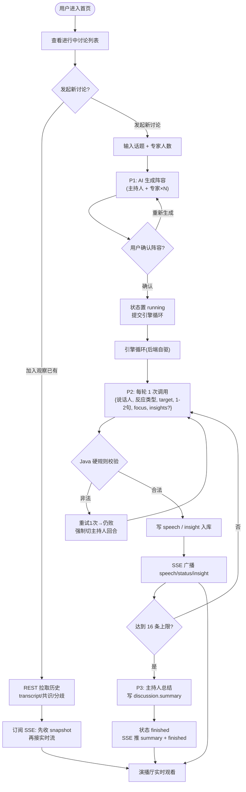

# AI 圆桌讨论 MVP · 产品需求文档(PRD)

> 「AI Panel Studio」——一款本地运行的「AI 圆桌讨论」Web 应用。用户输入任意话题并指定专家人数,系统动态生成主持人 + 专家阵容,进入演播厅观看一场由 AI 驱动、实时推进的圆桌讨论。
> 本文是 SDD(契约/模型驱动)阶段的产品基线,上承 `BRAINSTORM.md` 的澄清结论,下接 `architecture.md`(技术设计)与 `API.md`(接口契约)。

---

## 1. 产品定位

一键召集一支「虚拟智库」,围绕任意议题展开对抗性深度讨论。主持人负责开场、追问、串联、收尾;专家之间基于内容自主「举手/抢答/补充/反驳」;讨论过程中持续提炼共识与分歧,最终由主持人自然语言收尾。

**核心价值:** 把「单一 AI 对话的单视角结论」升级为「多角色实时碰撞的沉浸式圆桌实况」。

**一句话架构立场:** 后端是唯一引擎,自驱多个讨论并行推进、写库、SSE 广播;前端是纯观察者,不驱动任何讨论逻辑。

---

## 2. 用户痛点

| # | 痛点 | 本产品如何解 |
|---|---|---|
| 1 | **视角单一**:单一 AI 对话立场单一,缺乏对抗性思考的深度 | 多专家不同立场 + 反驳/补充机制,制造真实辩论张力 |
| 2 | **异步割裂**:分别问不同角色的 AI,上下文割裂、观点不互动 | 同一 transcript 上下文共享,发言基于彼此内容接话 |
| 3 | **过程不可见**:AI 只给最终结论,无「思考过程」与「观点演化」 | 实时 SSE 推流 + 专家状态小窗 + 实时共识/分歧,过程可见 |
| 4 | **议题管理混乱**:多议题并行时上下文/进展/结论难隔离 | 多讨论并行,各自状态/事件流/transcript/共识分歧完全隔离 |

---

## 3. MVP 范围

### 3.1 必须做(7 项功能要求,一项不删)
1. **首页**:展示所有进行中的讨论列表;可发起新讨论,也可点进去观察已有讨论。
2. **嘉宾生成**:输入话题 + 专家人数(默认 4)→ AI 生成主持人 + 专家阵容(姓名、职业/Title、立场、专属色)→ 用户确认后进入演播厅。
3. **演播厅**:主持人开场/追问/串联/总结;专家基于当前 transcript 内容自主决定发言(举手/抢答/补充/反驳),每次 1–2 句,**非机械轮流**。
4. **专家状态小窗**:每位专家独立小窗,实时显示 Agent 状态(待机/准备发言/发言中)与公开关注点,**不展示真实隐藏 CoT**。
5. **实时共识与分歧**:讨论过程中持续提炼,实时更新对应区域,**不等结束才生成**。
6. **现场 Transcript**:显示发言人姓名 + 职业/Title,用与专家一致的色块区分;**不显示「举手」等内部事件**。
7. **总结**:结束时主持人自然语言总结,**禁止把 JSON 原文显示到页面**。

### 3.2 明确不做(YAGNI)
| 砍除项 | 理由 |
|---|---|
| 多用户 / 账号 / 登录 | 本地 App,「加入观察」= 打开讨论页订阅其 SSE 流,无需 auth |
| 中途人工干预(插话/投票/踢人) | 文档未要求,纯观看 |
| 讨论暂停/继续/编辑阵容 | 生成→确认→跑完一条直线,中途控制是复杂度黑洞 |
| 专门录制/导出 | SQLite 已存 transcript,天然可回看,不做导出模块 |
| PWA / 移动手势 | 只做响应式布局,不做 App 化 |
| 提前收尾(主持人判定议题充分) | MVP 用硬上限收尾;智能收尾列入后续改进 |

### 3.3 保留的硬约束
- **断点续看**:打开已有讨论 = 先从 SQLite 加载历史(transcript/共识/分歧)→ 再续订 SSE 实时流。
- **三档响应式**(超宽/桌面/窄屏):各区域在自身容器内独立滚动,不靠整页滚动。**打分项,认真做**。
- **前端一次专注一个讨论**,通过列表切换。
- **预算护栏**(¥10 Deepseek):并发讨论上限 3、每讨论发言硬上限 16、1 次 AI 调用/轮。

---

## 4. 页面清单

| 页面 | 路由(示意) | 核心区域 | 说明 |
|---|---|---|---|
| **首页** | `/` | 讨论列表(话题/状态/人数)+「发起新讨论」入口 | 状态含 running/finished/interrupted |
| **嘉宾生成确认页** | `/new` | 话题输入 + 人数选择 + 生成的阵容卡片(名/职/Title/立场/色)+「确认进入」 | 确认前可重新生成 |
| **演播厅页** | `/discussions/:id` | ① 现场 Transcript ② 专家状态小窗组 ③ 实时共识/分歧 ④ 主持人总结区 | 三档响应式,各区独立滚动 |

> 演播厅四区在超宽屏可三/四栏并列,桌面两栏,窄屏纵向堆叠但各区仍独立滚动。

---

## 5. 核心流程

---

## 6. 核心用户旅程

### 旅程 A · 发起者(知识工作者 / 决策人员)
| 阶段 | 用户动作 | 用户心理 | 系统响应 |
|---|---|---|---|
| 触发 | 带着一个待审视议题打开首页 | "想快速听到多方观点" | 展示进行中讨论列表 + 发起入口 |
| 配置 | 输入话题、选专家人数 | "希望阵容专业、立场有差异" | P1 生成主持人 + 专家卡片(名/职/Title/立场/色) |
| 确认 | 审阅阵容,满意则确认(否则重新生成) | "这几位能碰撞起来吗" | 确认 → `status: running` → 提交引擎循环 |
| 观看 | 进入演播厅看实时推进 | "过程要可见、有碰撞感" | SSE 推 speech/status/insight;小窗动态、共识分歧实时更新 |
| 收获 | 讨论收尾读总结 | "给我可带走的结论" | 主持人自然语言总结(页面无 JSON 原文) |
| 复访 | 之后再打开该讨论回看 | "想重温某段争论" | REST 拉历史完整回放 |

### 旅程 B · 观察者(加入已有讨论)
| 阶段 | 用户动作 | 用户心理 | 系统响应 |
|---|---|---|---|
| 选择 | 首页点一个 running 讨论 | "现在进行到哪了" | REST 拉取已产生的 transcript/共识/分歧 |
| 接入 | 自动订阅实时流 | "别让我看到空白小窗" | 先推 `snapshot` 重建小窗,再接实时事件 |
| 跟看 | 持续观看讨论推进 | "别断、别乱序" | ~20s 心跳保活;前端按 `seq`/`created_at` 去重排序 |
| 容错 | 遇网络抖动 / 服务重启 | "别崩给我看" | `EventSource` 自动重连兜底;残留 running 标 `interrupted` 显"已中断",历史照看 |

---

## 7. 技术方案

| 层 | 选型 | 关键理由 |
|---|---|---|
| 前端 | React + Vite + TypeScript | 组件化契合四区演播厅;Vite 本地起步快;TS 对齐 SDD 契约类型 |
| 实时 | SSE(浏览器原生 `EventSource`) | 数据流单向(引擎→前端),WebSocket 双向能力浪费;原生自动重连贴合「加入/续看」 |
| 后端 | Spring Boot + MyBatis-Plus | `SseEmitter` 原生支持零额外依赖;MyBatis-Plus 少写样板 |
| 存储 | SQLite(WAL 模式) | 作业指定;WAL 让多引擎线程写 + 请求线程读不互斥 |
| AI | Deepseek V4 Pro(Key 仅后端环境变量) | Key 绝不暴露浏览器;全系统仅 3 种 Prompt(P1/P2/P3) |

**并发/隔离模型:** `ConcurrentHashMap<discussionId, DiscussionSession>` 以 id 为隔离边界;每个活跃讨论 = 有界线程池(上限 3)的一个长任务;emitters 用 `CopyOnWriteArrayList`。

**详细数据模型、服务层约定、AI 编排、红线清单、验收标准见 `architecture.md`;接口契约见 `API.md`。**

---

## 8. 主要风险与缓解

| # | 风险 | 影响 | 缓解措施 |
|---|---|---|---|
| R1 | **¥10 预算烧穿**(后端自驱、无人观看也跑) | 无法继续开发/演示 | 并发上限 3 + 每讨论硬上限 16 轮 + 严格 1 调用/轮;上限计数器绝对兜底,永不无限循环 |
| R2 | **AI 输出非法/幻觉**(反驳无 target、连说、乱选人) | 讨论退化或崩溃 | P2 输出走 schema 校验 + Java 硬规则;非法则重试 1 次→仍败强制切主持人回合(约束最松)续跑;连续崩才 error+暂停 |
| R3 | **SSE 死连接泄漏** | 内存增长、向死连接推送报错 | 注册 `onCompletion/onTimeout/onError`,断开即从 emitter 列表移除;~20s `:ping` 心跳保活 |
| R4 | **拉历史 ↔ 接实时流竞态**(重复/乱序) | Transcript 错乱 | snapshot 兜底替代事件重放;前端按 `speech.seq` / `insight.created_at` 去重排序 |
| R5 | **服务重启丢失内存 session** | running 讨论卡死 | 启动时把残留 running 标 `interrupted`,前端显「已中断」,历史 transcript 照常可看;崩溃恢复列入后续改进 |
| R6 | **SQLite 并发写锁** | 引擎线程写阻塞 | 开启 WAL(`PRAGMA journal_mode=WAL`),读不阻塞写 |
| R7 | **机械轮流**(踩产品还原度打分项) | 不像真实圆桌 | 「选谁」由 LLM 基于内容相关性判定;Java 只做硬规则不排班;反应类型驱动小窗 |
| R8 | **响应式不达标**(打分项) | 超宽/窄屏体验差 | 三档断点 + 各区独立滚动容器,桌面优先、窄屏纵向堆叠 |
| R9 | **API Key 泄漏浏览器** | 安全事故 | Key 仅后端环境变量读取;前端只连本地后端,绝不含任何模型 Key |

---

*(下一步 SDD 交付物:`docs/architecture.md`。)*
