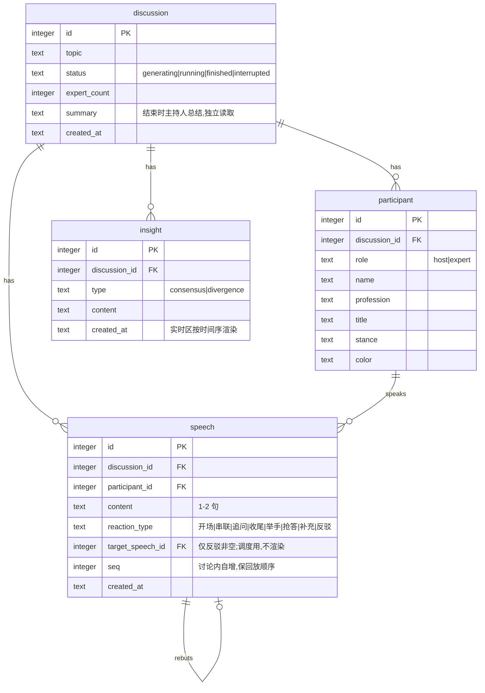

# AI 圆桌讨论 MVP · 技术架构文档(Architecture)

> SDD 阶段技术设计,上承 `PRD.md`,是实现(DDD/TDD 阶段)的唯一技术事实源。数据模型与本文一致的可执行版本见 `db/schema.sql`,接口契约见 `docs/API.md`。
> 核心立场:**后端唯一引擎,自驱多讨论并行、写库、SSE 广播;前端纯观察者。**

---

## 1. 技术栈

| 层 | 选型 | 版本基线 | 关键理由 |
|---|---|---|---|
| 前端 | React + Vite + TypeScript | React 18 / Vite 5 | 组件化契合四区演播厅;TS 对齐 SDD 契约 |
| 实时 | SSE(原生 `EventSource`) | — | 单向流,WebSocket 双向浪费;原生自动重连 |
| 后端 | Spring Boot + MyBatis-Plus | Boot 3.x / JDK 17 | `SseEmitter` 原生;MyBatis-Plus 省样板 |
| 存储 | SQLite(WAL) | 3.x | 作业指定;WAL 读写不互斥 |
| AI | Deepseek V4 Pro | — | Key 仅后端环境变量;3 种 Prompt(P1/P2/P3) |

---

## 2. 目录结构

```
ai-disscussion/
├─ docs/                     # PRD / architecture / API / BRAINSTORM / PROMPT_LOG
├─ db/
│  ├─ schema.sql             # 建表 + 索引 + WAL pragma
│  └─ seed.sql               # ≥5 条样例讨论及阵容
├─ backend/                  # Spring Boot
│  └─ src/main/java/.../panel/
│     ├─ controller/         # DiscussionController(REST) + StreamController(SSE)
│     ├─ service/            # DiscussionService / EngineService / AiService / InsightService
│     ├─ engine/             # DiscussionSession(内存态) + DiscussionRegistry + 调度硬规则
│     ├─ ai/                 # DeepseekClient + Prompt 模板(P1/P2/P3) + 输出解析
│     ├─ sse/                # SseHub(每讨论 emitter 组 + 广播 + 死连接清理)
│     ├─ mapper/             # MyBatis-Plus Mapper
│     ├─ entity/             # discussion/participant/speech/insight
│     └─ dto/                # 请求/响应/SSE 事件 payload
└─ frontend/                 # React + Vite
   └─ src/
      ├─ pages/              # HomePage / NewDiscussionPage / StudioPage
      ├─ components/         # Transcript / ExpertPanel / InsightBoard / SummaryBox
      ├─ hooks/              # useDiscussionStream(SSE 订阅 + 去重排序)
      ├─ api/                # REST 客户端 + 类型(对齐 API.md)
      └─ types/              # 与后端 DTO 对齐的 TS 类型
```

> ponytail:目录按「职责」而非「层数」切分。`engine/` 是整个后端的心脏,单独成包;`sse/` 只做推流不含业务。不预设 `config/`、`util/` 空目录,需要时再建。

---

## 3. 数据模型

4 张表。隔离字段:除 `discussion` 外每表都带 `discussion_id`,是多讨论并行隔离的物理边界。



### 落库 vs 内存(关键切分)
- **落库(耐久结果)**:`discussion`、`participant`、`speech`、`insight`。
- **内存 + 快照(瞬时状态,不建历史表)**:每位专家 `status`(待机/准备发言/发言中)与 `focus`(公开关注点)。新 SSE 连接接入时先推 `snapshot` 事件重建小窗,再接实时流。
- **不建 `event` 表**:事件流隔离靠「每讨论内存通道 + 独立 SSE」;`reaction_type`/`target_speech_id` 仅调度与小窗,不作为文字进 transcript。

### 索引
- `speech(discussion_id, seq)`:transcript 按序拉取。
- `insight(discussion_id, created_at)`:实时区按时间序拉取。
- `participant(discussion_id)`:阵容查询。

---

## 4. 服务层约定

| 服务 | 职责 | 不做 |
|---|---|---|
| `DiscussionService` | 讨论 CRUD、阵容确认、历史组装(transcript/insight) | 不推进讨论、不写 running 后的 status |
| `EngineService` | 管理 `DiscussionRegistry`;确认后提交讨论到有界线程池;跑推进循环 | 不直接碰 HTTP |
| `AiService` | 封装 P1/P2/P3 三次调用 + 输出解析校验 | 不写库、不广播 |
| `InsightService` | 从 P2 主持人回合输出中解析 insight、去重、入库 | 不生成 insight(生成在 P2) |
| `SseHub` | 每讨论 emitter 组、广播、心跳、死连接清理 | 不含业务逻辑 |

### 并发与隔离
- **注册表**:`ConcurrentHashMap<Long, DiscussionSession>`,key 即隔离边界。
- **有界线程池**:并发活跃讨论上限 **3**(`application.yml` 可配),超出排队。
- **emitters**:`CopyOnWriteArrayList`(广播读多、连接/断开写少)。
- **单写者纪律**:`generating` 阶段请求线程写 `status`;**「用户确认→提交 loop」为交接点**;`running` 起该 session 引擎线程**独占**写 `status`/`liveState`。任何时刻无双写。
- **SQLite**:启动执行 `PRAGMA journal_mode=WAL`。

### DiscussionSession(内存态)
```
DiscussionSession {
  discussionId
  emitters : CopyOnWriteArrayList<SseEmitter>
  liveState : { currentSpeakerId, experts: Map<id, {status, focus}> }  // snapshot 数据源
  speechCount                                                          // 硬上限计数器
}
```

---

## 5. AI 调用编排

全系统仅 3 种 Prompt。Key 仅后端环境变量读取,绝不进浏览器。

| # | Prompt | 频次 | 输入 → 输出 |
|---|---|---|---|
| **P1 阵容生成** | 每讨论 1 次 | topic + 人数 → `[host, expert×N]`(名/职/Title/立场/色) |
| **P2 每轮发言** | 每轮 1 次(≤16) | transcript + 阵容 → `{speakerId, reactionType, targetSpeechId?, content, focus?, insights?}` |
| **P3 结束总结** | 每讨论 1 次 | 全 transcript → 自然语言 summary |

- 主持人开场 = **P2 第一轮**(强制 speaker=host, type=开场),不单开调用。
- 每讨论 ≈ 1 + 16 + 1 = **18 次调用**,并发上限 3,¥10 测试足够。

### 调度硬规则(Java 侧,可见的调度逻辑)
「选谁下一个说」由 LLM 基于 transcript 内容相关性判定(**非机械轮流**);Java 只校验、不排班:
1. 不允许同一专家连说两次(唯一例外:`补充` 自己上一句);
2. `反驳` 必须指向已存在的 `speech`(`targetSpeechId` 有效),否则非法;
3. 主持人节奏计数器:开场固定首发 → 每 ~3–4 条专家发言插一次(串联/追问)→ 上限收尾;
4. 每次发言 1–2 句:prompt 约束 + Java 软校验超长截断;
5. **硬上限 16 条**(`application.yml` 可配)→ 触发 P3 收尾。

### 共识提炼:仅主持人回合
- `insights` 融进 P2 输出,但**仅当该回合是主持人(串联)时填充**;专家回合 `insights` 留空。
- 理由:共识/分歧是旁观者视角的元判断,由中立主持人提炼质量更高,恰对上「串联」职责。仍 1 调用/轮、仍实时。
- `InsightService` 对 insight 去重后入库并广播 `insight` 事件。

### 小窗状态由 1 调用/轮驱动
- 空闲专家 = `待机`(无 focus),**不为空闲专家编造思考**;
- P2 点名的「下一位」→ `准备发言`,focus = P2 返回的 focus;
- 正在说的 → `发言中`。

### 失败降级(防幻觉/防退化)
```
P2 输出非法(反驳无 target / 连说 / speakerId 不存在)
  → 重试 1 次
    → 仍失败:强制切一个主持人回合(约束最松、几乎必合法)让讨论续跑
      → 连续多次失败 或 主持人回合也崩:推 error 事件 + 该讨论暂停(interrupted)
```

---

## 6. SSE 事件契约(7 种)

| event | 何时推 | payload 要点 |
|---|---|---|
| `snapshot` | 新连接接入 | `{currentSpeakerId, experts:[{participantId,status,focus}]}` |
| `speech` | 有新发言 | `{id, participantId, content, reactionType, seq, createdAt}` |
| `insight` | 提炼出共识/分歧 | `{id, type, content, createdAt}` |
| `status` | 专家状态变化 | `{participantId, status, focus}`(focus 并入,不单开事件) |
| `summary` | 讨论收尾 | `{summary}`(自然语言,禁 JSON 原文上屏) |
| `finished` | 讨论结束 | `{discussionId}`(前端停流) |
| `error` | AI 调用失败 | `{message}`(前端亮错误态 + 提示重试) |

> 保活:`SseEmitter` 长超时 + 每 ~20s `:ping` 注释心跳;断线续看靠 REST 拉历史 + `snapshot` 兜底,**不做 Last-Event-ID 事件重放**。前端按 `speech.seq` / `insight.created_at` 去重排序。

---

## 7. 开发约束

- **API Key 只在后端**从环境变量读取,任何前端产物、日志、SSE payload 都不得包含 Key。
- **前后端分离**,可本地独立运行。
- **中文 UI + 三档响应式**:各区域自身容器内独立滚动,不靠整页滚动。
- **禁止一键生成**:分阶段工程拆解(SDD→DDD→TDD→E2E),Commit 历史呈层级演进。
- **Prompt 版本化**:P1/P2/P3 模板集中管理,便于 TDD 插桩。
- **JSON 不上屏**:模型返回的结构化 JSON 仅后端消费,页面只呈现自然语言与结构化 UI。

---

## 8. 禁止破坏的逻辑(红线清单)

| # | 红线 | 违反后果 |
|---|---|---|
| L1 | 讨论推进循环**只在后端**,前端绝不驱动 | 破坏「后端自驱、多观众一致」架构 |
| L2 | `running` 起 `status`/`liveState` **单写者(引擎线程)** | 并发写状态/库锁地狱 |
| L3 | 每讨论**硬上限 16 轮**不可绕过 | ¥10 预算烧穿 |
| L4 | 并发活跃讨论**上限 3** | 线程/token 双爆炸 |
| L5 | P2 输出**先校验硬规则再入库/广播** | 幻觉/非法数据污染 transcript |
| L6 | `reaction_type`/内部事件**不渲染进 transcript** | 违反「不显示举手等内部事件」 |
| L7 | 共识提炼**仅主持人回合**填充 insights | 专家回合背提炼任务,质量下降且多耗 token |
| L8 | 新 SSE 连接**先 snapshot 再实时流** | 中途加入看到空白小窗 |
| L9 | 死连接必须从 emitter 组**移除** | 内存泄漏 + 推送报错 |
| L10 | 总结区**只显自然语言**,禁 JSON 原文 | 违反作业硬要求 |

---

## 9. 验收标准(可测判据)

> 作为 TDD/E2E 阶段的目标锚点,每条都可自动化验证。

| # | 判据 | 验证方式 |
|---|---|---|
| A1 | 输入话题 + 人数 N,P1 返回 1 主持人 + N 专家,字段齐全(名/职/Title/立场/色) | 单元测试插桩 P1,断言结构 |
| A2 | 阵容确认后 `status: generating→running`,并提交引擎循环 | 服务测试断言状态流转 |
| A3 | 讨论发言总数 ≤ 16,达上限自动进 P3 收尾 | 引擎测试断言计数器与终止 |
| A4 | 无同一专家连说两次(除 `补充` 自己上一句) | 调度规则单元测试 |
| A5 | `反驳` 的 `targetSpeechId` 必指向已存在 speech,否则被拒重试 | 调度规则单元测试 |
| A6 | 仅主持人回合产出 insight;专家回合 insight 为空 | InsightService 测试 |
| A7 | 两个并行讨论的 speech/insight/事件流互不串味 | 并发集成测试断言 discussion_id 隔离 |
| A8 | 新连接先收 `snapshot` 再收实时事件,小窗非空白 | SSE 集成测试断言事件顺序 |
| A9 | 断开连接后 emitter 组不再含该连接,不向其推送 | SSE 生命周期测试 |
| A10 | AI 失败经重试→主持人回合降级;仍崩则推 `error` | 失败注入测试 |
| A11 | E2E:发起讨论→观看实时推进→出现共识/分歧→收尾显示自然语言总结,页面无 JSON 原文 | Playwright E2E |
| A12 | 三档响应式下四区各自独立滚动,无整页滚动 | E2E 视口断言 |

---

*(下一步 SDD 交付物:`db/schema.sql` + `db/seed.sql` + `docs/API.md`。)*
