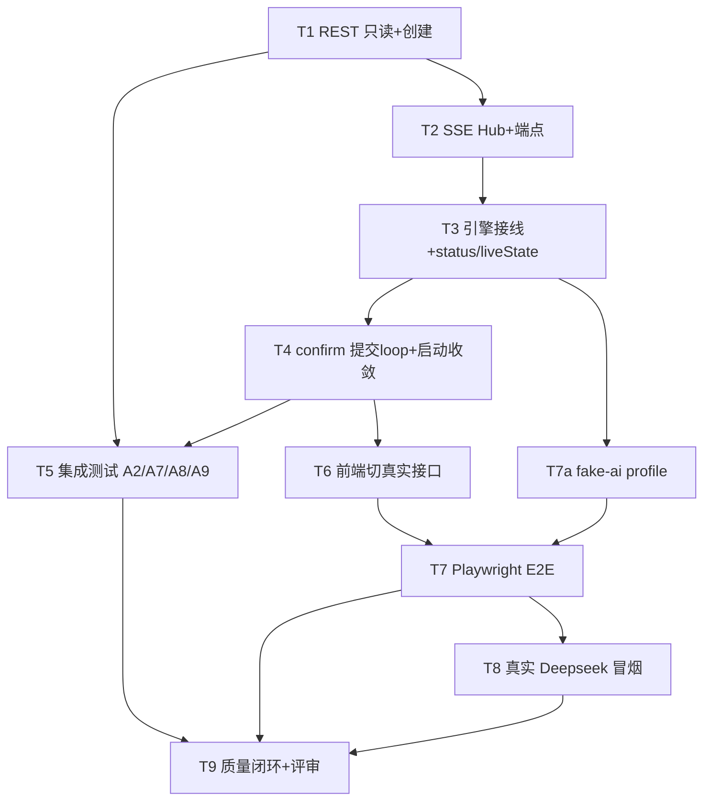

# Web 层接线 + 端到端质量闭环 实现计划(阶段 5)

> **For agentic workers:** 用 `superpowers:subagent-driven-development` 或逐任务执行。每任务:实现 → 跑该层测试/验收 → commit。步骤用 `- [ ]` 跟踪。

**Goal:** 在已全绿的核心逻辑之上建 Web 层(REST + SSE + 引擎真跑),前端切真实接口,用"假 AI"跑确定性 E2E,真实 Deepseek 只做一次小成本冒烟,最后质量闭环。

**Architecture:** 后端唯一引擎自驱;请求线程只做 CRUD 与"确认→提交 loop"交接,`running` 起引擎线程独占写状态;SSE 每讨论一组 emitter,新连接先 snapshot 再实时;E2E 用 `fake-ai` profile 避开 Deepseek 花费与 flaky。

**Tech Stack:** Spring Boot 3 + MyBatis-Plus + SQLite(已就位)· Spring `SseEmitter`(内置,不引 WebSocket)· `ThreadPoolTaskExecutor`(内置)· React+Vite `EventSource`(原生)· Playwright(E2E,新增 dev 依赖)。

**红线(每任务验收内建):** key 只从 env · 页面无 JSON/无内部事件 · 无整页滚动 · 硬上限 16/并发 3 · 单写者 · 死连接清理 · 真实 Deepseek 花费受控。

---

## 文件结构(新增/改动)

```
backend/src/main/java/com/panel/
├─ web/
│  ├─ DiscussionController.java     # REST
│  ├─ StreamController.java         # SSE 端点
│  ├─ GlobalExceptionHandler.java   # {code,message} 统一错误体
│  └─ dto/  DiscussionDetailDto / RosterResponseDto / CreateDiscussionReq / ErrorBody
├─ sse/
│  ├─ SseHub.java                   # 每讨论 emitter 组 + 广播 + 心跳 + 清死连接
│  └─ SseEventPublisher.java        # implements EventPublisher → 广播 + 更新 liveState
├─ engine/
│  ├─ DiscussionRegistry.java       # ConcurrentHashMap<id, DiscussionSession(liveState)>
│  ├─ DiscussionSession.java        # 内存态:currentSpeakerId + 每专家 status/focus(snapshot 源)
│  ├─ EngineService.java            # 有界线程池(3)+ 提交 runDiscussion
│  ├─ EngineConfig.java             # @Bean DiscussionEngine(注入 maxSpeeches)
│  └─ DiscussionEngine.java         # 扩展:发 status 事件 + 更新 liveState(附加,测试不破)
├─ service/DiscussionService.java   # 持久化阵容 / 组装历史 / 确认交接
├─ ai/FakeAiService.java            # @Profile("fake-ai") 固定 canned P1/P2/P3
└─ StartupRunner.java               # 启动:残留 running → interrupted
backend/src/test/java/com/panel/web/  # A2/A7/A8/A9 集成测试
backend/.env                          # DEEPSEEK_API_KEY / DEEPSEEK_MODEL(不入库)

frontend/src/
├─ api/client.ts                    # 改:真实 fetch(删 mockData/DEMO_STATUS 依赖)
├─ hooks/useDiscussionStream.ts     # 新:EventSource(替 useMockStream)
├─ vite.config.ts                   # 加 /api 代理 → :8080
e2e/                                 # Playwright 用例 + 配置
```

---

## 依赖顺序



---

## T1 · REST 只读 + 创建/重生成(feat)

**Files:** `web/DiscussionController`、`web/dto/*`、`web/GlobalExceptionHandler`、`service/DiscussionService`。

- [ ] REST DTO:`CreateDiscussionReq{topic,expertCount}`;`RosterResponseDto{id,topic,status,expertCount,participants}`;`DiscussionDetailDto{discussion,participants,speeches,insights}`。ponytail:列表/详情直接序列化实体(字段已 camelCase),仅嵌套结构用 record。
- [ ] `DiscussionService.createWithRoster(topic,count)`:插 discussion(status=generating)→ `RosterService.generateRoster` → 回填 discussionId 批量插 participant → 返回 RosterResponseDto。
- [ ] `DiscussionService.regenerate(id)`:仅 generating 可调(否则 409)→ 删旧 participant + 重跑 P1 插新。
- [ ] `DiscussionService.detail(id)`:组装 discussion+participants+speeches(按 seq)+insights(按 createdAt);不存在 404。
- [ ] `DiscussionController`:`GET /api/discussions`(列表)、`POST /api/discussions`、`POST /{id}/regenerate`、`GET /{id}`。
- [ ] `GlobalExceptionHandler`:`ValidationException`→400、`AiUpstreamException`→502、NotFound→404,统一 `{code,message}`。
- [ ] commit `feat(web): REST 讨论 CRUD(列表/创建P1/重生成/详情)`

**验收:** MockMvc 打四个端点均 2xx/正确错误码;创建后 DB 有 discussion(generating)+participants;P1 用 `@MockBean AiService` 打桩,不走真实网络。

---

## T2 · SSE Hub + 端点 + 事件出口(feat)

**Files:** `sse/SseHub`、`sse/SseEventPublisher`、`web/StreamController`。

- [ ] `SseHub`:`Map<Long, CopyOnWriteArrayList<SseEmitter>>`;`register(id, emitter)`(注册 onCompletion/onTimeout/onError → 从组移除);`broadcast(id, eventName, payload)`;`@Scheduled(20s)` 对所有 emitter 发 `:ping` 注释保活。
- [ ] `SseEventPublisher implements EventPublisher`:六类事件 → `SseHub.broadcast`;同时把 status/currentSpeaker 写入 `DiscussionRegistry` 的 liveState(供 snapshot)。ponytail:先建 Registry 空壳(T3 填 liveState 更新逻辑),此步只搭接口。
- [ ] `StreamController.stream(id)`:`return SseHub.subscribe(id)` —— 建 emitter、`register`、**先推 `snapshot`(从 registry liveState)** 再返回;超长超时(0=不超时)。
- [ ] commit `feat(sse): SseHub 每讨论 emitter 组 + 广播 + 心跳 + 死连接清理`

**验收:** 单测/MockMvc 订阅 `/stream` 返回 `text/event-stream`;断开后组内不再含该 emitter(A9 在 T5 正式断言);snapshot 首帧存在(A8 在 T5)。

---

## T3 · 引擎接线 + status/liveState(feat)

**Files:** `engine/DiscussionRegistry`、`engine/DiscussionSession`、`engine/EngineService`、`engine/EngineConfig`、改 `engine/DiscussionEngine`。

- [ ] `DiscussionSession`:`currentSpeakerId` + `Map<Long,{status,focus}>`;`snapshot()` 产出 snapshot payload。
- [ ] `DiscussionRegistry`:`ConcurrentHashMap<Long,DiscussionSession>`;get/create/remove。
- [ ] `EngineConfig`:`@Bean DiscussionEngine`(注入 AiService/TurnScheduler/InsightExtractor/mappers/SseEventPublisher/`${panel.max-speeches}`)。
- [ ] `EngineService`:`ThreadPoolTaskExecutor`(core=max=`${panel.max-concurrent-discussions:3}`,有界队列);`submit(id, roster)` → `engine.runDiscussion`。
- [ ] **扩展 `DiscussionEngine`(附加,不改现有断言):** 每轮广播前 `events.status(准备发言/发言中)` + 更新 registry liveState;轮末置发言人 `待机`。DiscussionEngineTest 的 mock EventPublisher 为 lenient,新增 status 调用不破坏既有 4 绿。
- [ ] commit `feat(engine): DiscussionRegistry + 有界线程池 + status/liveState 广播`

**验收:** DiscussionEngineTest 仍 4 绿(附加 status 不破);EngineService 提交后引擎线程独立跑;并发上限 3 生效(配置读取)。

---

## T4 · confirm 提交 loop + 启动收敛(feat)

**Files:** 改 `web/DiscussionController`(confirm)、`service/DiscussionService`(confirm 交接)、新 `StartupRunner`。

- [ ] `POST /{id}/confirm`:仅 generating→ `updateStatus(running)`(请求线程,单写者交接点)→ `EngineService.submit(id, roster)` → 202 `{id,status:running}`;非 generating→409。
- [ ] `StartupRunner implements ApplicationRunner`:`UPDATE discussion SET status='interrupted' WHERE status='running'`(重启残留收敛)。
- [ ] 确认 WAL+foreign_keys 生效(URL 已配,启动打印一行 journal_mode 自检)。
- [ ] commit `feat(web): confirm→running 提交引擎循环 + 启动残留收敛`

**验收:** confirm 后 DB status=running 且引擎已提交;重启后原 running 变 interrupted;`PRAGMA journal_mode` 打印 wal。

---

## T5 · 集成测试(test)—— 补 TDD 留的集成级验收

**Files:** `test/web/DiscussionApiIT`、`test/web/SseIsolationIT`。`@SpringBootTest` + `@MockBean AiService`(canned)。

- [ ] **A2** `confirm_transitionsToRunning_andSubmits`:POST confirm → DB status=running(+ 轮询到至少一条 speech 入库,证明 loop 起跑)。
- [ ] **A7** `twoDiscussions_isolated_noCrossContamination`:并行两讨论,断言各自 speech/insight 的 discussion_id 只属本讨论,事件互不串。
- [ ] **A8** `newConnection_snapshotBeforeRealtime`:订阅 `/stream`,断言首个事件是 `snapshot`,其后才是 `speech`。
- [ ] **A9** `disconnect_removesEmitter`:订阅后断开 → SseHub 该讨论 emitter 组不再含之。
- [ ] commit `test(web): 集成验收 A2/A7/A8/A9(确认交接/并行隔离/snapshot 先行/死连接清理)`

**验收:** 四条全绿;仍 `@MockBean AiService`,零真实网络。

---

## T6 · 前端切真实接口(feat)

**Files:** 改 `frontend/src/api/client.ts`、新 `hooks/useDiscussionStream.ts`、改 `StudioPage.tsx`、`vite.config.ts`;删 `DEMO_STATUS`(及 mock 专用路径)。

- [ ] `vite.config.ts`:`server.proxy['/api'] → http://localhost:8080`。
- [ ] `client.ts`:五个方法改真实 `fetch`(签名不变,页面不动)。删 `DEMO_STATUS`;`mockData.ts` 降级为 E2E/离线参考或删除。
- [ ] `useDiscussionStream(id)`:`EventSource('/api/discussions/{id}/stream')`,监听七类命名事件,产出与 `useMockStream` 同形 state;按 `speech.seq`/`insight.createdAt` 去重排序;原生自动重连。`StudioPage` 由 `useMockStream` 换成它(签名已对齐)。
- [ ] commit `feat(web): 前端切真实 REST+EventSource,移除 DEMO_STATUS`

**验收:** `npm run build` 通过;本地起后端(fake-ai)+前端,手点首页→详情能看到真实流;无残留 mock 演示态。

---

## T7 · fake-ai profile + Playwright E2E(feat + test)

**Files:** `ai/FakeAiService.java`(`@Profile("fake-ai")`)、`DeepseekAiService` 加 `@Profile("!fake-ai")`;`e2e/`(playwright.config + specs);`db` 用全新 schema+seed 临时库。

- [ ] `FakeAiService`:固定 canned P1(1主持+N专家)/P2(依 transcript 长度产出确定发言,含 1 次反驳带合法 target、末段共识/分歧)/P3(固定总结);零网络、确定性。
- [ ] Playwright 用例:**发起→生成→确认→观看实时推进→出现共识/分歧→收尾总结**;并行两讨论隔离;断言**页面无 JSON 原文、无"举手"等内部事件**、三档视口下无整页滚动。
- [ ] E2E 脚本:清库→`schema.sql`+`seed.sql`→起后端 `SPRING_PROFILES_ACTIVE=fake-ai`→起前端→跑 specs。
- [ ] commit `test(e2e): Playwright 端到端(假 AI,确定性)覆盖主流程+隔离+红线`

**验收:** E2E 全绿、可重复、零 Deepseek 花费;截图/trace 留存;JSON/内部事件断言通过。

---

## T8 · 真实 Deepseek 冒烟(chore/docs)

**Files:** `backend/.env`(DEEPSEEK_API_KEY、DEEPSEEK_MODEL=真实 V4 Pro id)、`docs/SMOKE.md`(记录)。

- [ ] `DEEPSEEK_MODEL` 设账户里 **V4 Pro 真实模型 id**(非默认 `deepseek-chat` 糊弄);key 从 `${DEEPSEEK_API_KEY}` 读。
- [ ] 手动冒烟:`panel.max-concurrent-discussions=1`、`panel.max-speeches=6`,发起 1 场真实讨论,肉眼确认真链路通(P1 阵容/实时发言/共识分歧/收尾)。
- [ ] `docs/SMOKE.md` 记录:模型 id、轮次、观察、**花费**。
- [ ] commit `docs: 真实 Deepseek 冒烟记录(小上限,受控花费)`

**验收:** 真链路一次跑通并留证;花费记录在案;默认配置回到 3/16。

---

## T9 · 质量闭环 + 评审(收尾)

- [ ] `verification-before-completion`:跑**后端全套 + 前端 build + E2E**,贴真实输出。
- [ ] `requesting-code-review` → `receiving-code-review` 一轮,处理高优项。
- [ ] 更新 `README`(运行指南/环境变量/API 列表/已完成与后续)、`PROMPT_LOG` 补【TDD】【E2E】段。
- [ ] commit `docs: README + PROMPT_LOG TDD/E2E 段;chore: 评审修正`

**验收:** 全套绿的真实输出在案;评审闭环;交付物清单齐(README/API/测试/Prompt 记录/工作流)。

---

## Self-Review(spec 覆盖)
- 用户要求 1(Web/接线)→ T1–T4 全覆盖(REST/SSE/Registry/线程池/snapshot/单写者/启动收敛)。
- 要求 2(集成测试 A2/A7/A8/A9)→ T5。
- 要求 3(前端联调)→ T6。
- 要求 4(E2E 预算)→ T7(fake-ai 确定性)+ T8(真实小成本冒烟 + 真实模型 id)。
- 要求 5(收尾)→ T9(verification + review)。
- ponytail 取舍:SSE 用内置 `SseEmitter`(不引 WebSocket/STOMP);fake-ai 用 `@Profile`(不引测试替身框架);输出多用实体直接序列化(仅嵌套用 record);status/liveState 作为 DiscussionEngine 的附加广播(不新造事件总线)。
