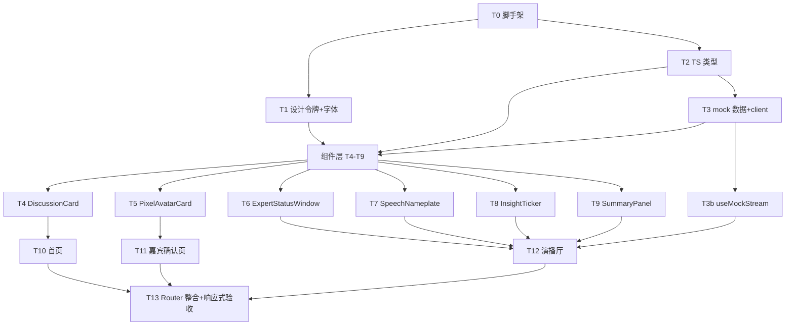

# 前端(纯 Mock)实现计划 · DDD 阶段

> **For agentic workers:** 用 `superpowers:subagent-driven-development` 逐任务实现。每任务两段审查:①对照 `design.md` 的 **spec 合规审查** → ②**代码质量审查**。步骤用 `- [ ]` 勾选跟踪。

**Goal:** 用 React+Vite+TS 搭出「圆桌像素演播厅」前端,六组件 + 三页面全用 mock 数据跑通,不接后端。

**Architecture:** 组件叶子优先、页面组合在上;设计令牌(CSS variables)作全局主题基座;mock 数据 + mock client 集中一处,接口形状对齐 `API.md`,后续可平滑替换为真实 fetch/EventSource;演播厅实时感用 `useMockStream`(定时回放 mock 的 7 种 SSE 事件)模拟。

**Tech Stack:** React 18 + Vite 5 + TypeScript + react-router-dom;状态仅 `useState`/`Context`(ponytail:不引状态管理库);Fusion Pixel 12 本地 woff2;像素资产 CSS(box-shadow/clip-path/steps())。

**约束红线(每任务验收都要过):** 中文 UI · design.md §6 三档响应式 + 各区独立滚动(无整页滚动) · 像素优先 CSS 少 PNG · `prefers-reduced-motion` 动效可关且状态不丢 · 全 mock 不接后端。

---

## 文件结构(架构 §2 对齐)

```
frontend/
├─ index.html
├─ package.json / vite.config.ts / tsconfig.json
└─ src/
   ├─ main.tsx                 # 入口 + Router
   ├─ App.tsx                  # 壳:路由 + 全局 LIVE/CRT overlay
   ├─ styles/
   │  ├─ theme.css             # §1/§2 设计令牌(色板/字体栈/断点)
   │  ├─ reset.css             # 无整页滚动基座
   │  └─ animations.css        # §4 keyframes + §4.5 运动安全
   ├─ assets/fonts/            # FusionPixel12.woff2(本地内嵌)
   ├─ types/
   │  ├─ dto.ts                # API.md REST DTO
   │  └─ sse.ts                # 7 种 SSE 事件 payload
   ├─ api/
   │  ├─ mockData.ts           # 仿 seed.sql:5 讨论+阵容+transcript+共识分歧
   │  └─ client.ts             # getDiscussions/getDiscussion/generateRoster…(mock 实现)
   ├─ hooks/
   │  └─ useMockStream.ts      # 定时回放 mock,模拟 7 种 SSE 事件
   ├─ components/
   │  ├─ DiscussionCard.tsx
   │  ├─ PixelAvatarCard.tsx
   │  ├─ ExpertStatusWindow.tsx
   │  ├─ SpeechNameplate.tsx
   │  ├─ InsightTicker.tsx
   │  └─ SummaryPanel.tsx
   └─ pages/
      ├─ HomePage.tsx
      ├─ NewDiscussionPage.tsx
      └─ StudioPage.tsx
```

---

## 依赖顺序



组件 T4–T9 彼此独立,可并行;三页面依赖各自组件。

---

## T0 · 脚手架 frontend/

**Files:** Create `frontend/`(Vite react-ts 模板)、`vite.config.ts`、`tsconfig.json`、`package.json`。

- [ ] Step 1: `npm create vite@latest frontend -- --template react-ts`
- [ ] Step 2: `cd frontend && npm i && npm i react-router-dom`
- [ ] Step 3: 清空模板样例(App.css 默认内容、logo 资产),留最小空壳
- [ ] Step 4: `npm run dev` 起服务,浏览器打开空壳页
- [ ] Step 5: commit `chore(frontend): scaffold React+Vite+TS shell`

**验收:** `npm run dev` 成功、页面空白无报错;目录符合上方结构;`react-router-dom` 已装。

---

## T1 · 设计令牌 + 字体(全局主题基座)

**Files:** Create `styles/theme.css`、`styles/reset.css`、`styles/animations.css`、`assets/fonts/FusionPixel12.woff2`;Modify `main.tsx`(引入三 css)。

- [ ] Step 1: 下载 Fusion Pixel 12(OFL)woff2 到 `assets/fonts/`(本地内嵌,运行时不依赖 CDN)
- [ ] Step 2: `theme.css` 落 §1 全部色令牌 + §2 字体栈 `--font-pixel`/`--font-readable` + §6 断点令牌;`@font-face` 声明 `font-display:swap`
- [ ] Step 3: `reset.css` 落无整页滚动基座:`html,body{height:100vh;overflow:hidden;margin:0}` + box-sizing
- [ ] Step 4: `animations.css` 落 §4 keyframes(wave/idle/bounce/mouth/live-blink/slide-in)+ §4.5 `@media (prefers-reduced-motion: reduce)` 关键动效关闭/降级
- [ ] Step 5: commit `feat(frontend): design tokens, pixel font & motion-safe base`

**验收(对照 design.md §1/§2/§4.5/§6):** 所有色/字体/断点为 CSS 变量;Fusion Pixel 本地加载生效(断网仍显像素字);正文对比达标;开启系统「减弱动态效果」后关键动效停止且状态仍可辨(静态样式兜底);body 无整页滚动。

---

## T2 · TS 类型(对齐 API.md)

**Files:** Create `types/dto.ts`、`types/sse.ts`。

- [ ] Step 1: `dto.ts` 定义 REST DTO:`DiscussionSummary`、`DiscussionDetail`、`Participant`(role/color…)、`Speech`(seq/reactionType/targetSpeechId)、`Insight`(type/createdAt)、枚举 `DiscussionStatus`/`ReactionType`/`ExpertStatus`/`InsightType`
- [ ] Step 2: `sse.ts` 定义 7 种事件 payload:`SnapshotEvent`/`SpeechEvent`/`InsightEvent`/`StatusEvent`/`SummaryEvent`/`FinishedEvent`/`ErrorEvent` + 判别联合 `StreamEvent`
- [ ] Step 3: commit `feat(frontend): TS types aligned to API contract`

**验收(对照 API.md §1/§2):** 字段名/枚举值与 API.md 完全一致(camelCase);7 种事件齐全;`StreamEvent` 可判别联合;`tsc --noEmit` 通过。

---

## T3 · Mock 数据 + client(集中管理,可替换)

**Files:** Create `api/mockData.ts`、`api/client.ts`。

- [ ] Step 1: `mockData.ts` 仿 `seed.sql` 造 5 场讨论(话题+主持人+4 专家阵容+transcript+共识分歧+summary);专家 color 复用 design.md §1 调色板;主持人中性灰 `#6B7280`
- [ ] Step 2: `client.ts` 暴露 Promise 接口:`getDiscussions()`、`getDiscussion(id)`、`generateRoster(topic,count)`、`regenerate(id)`、`confirm(id)`——**全部读 mockData**,函数签名对齐 API.md 便于后续替换 fetch
- [ ] Step 3: commit `feat(frontend): centralized mock data & client`

**验收:** 5 场讨论数据完整且风格拟真(非占位串);client 接口形状 = API.md;所有数据仅此一处,页面不散落硬编码;后续替换为真实 fetch 只需改 `client.ts`。

---

## T3b · useMockStream(模拟 SSE 实时感)

**Files:** Create `hooks/useMockStream.ts`。

- [ ] Step 1: 入参讨论 id;先回放该讨论历史(snapshot 初始小窗态),再用 `setInterval` 逐条吐 `speech`/`status`/`insight`,末尾吐 `summary`+`finished`
- [ ] Step 2: 返回 `{speeches, insights, expertStates, summary, phase}`;组件消费即得"直播"观感;卸载清 interval
- [ ] Step 3: commit `feat(frontend): mock SSE stream hook`

**验收:** 演播厅接入先见 snapshot(小窗非空白)、再逐条推进;事件类型覆盖 7 种;签名与未来 `useDiscussionStream`(EventSource)可对齐替换。

---

## T4–T9 · 六组件(叶子层,可并行)

> 每个组件统一交付:`Props` 接口(取自 design.md §3)+ 变体 + 像素 CSS(优先 box-shadow/clip-path/steps())。每任务收尾:**spec 合规审查(对照 design.md 对应小节)→ 代码质量审查 → commit**。

### T4 · DiscussionCard(§3.1)
Props: `{topic;status;expertCount;createdAt;onEnter}`。变体:running(🔴LIVE 呼吸)/finished(灰✓)/interrupted(信号断裂+dim)。
**验收:** 三状态视觉区分;LIVE 用 `--live-red`;reduced-motion 下 LIVE 转常亮;键盘可聚焦可进入。

### T5 · PixelAvatarCard(§3.2)
Props: `{name;profession;title;stance;color;role}`。CSS 像素头(西装/眼镜/发型差异化)。**主持人变体**:中性灰 + "主持"标 + 更宽/居中,不混入专家排列。
**验收:** 专家外框=color;主持人差异化落地;头像纯 CSS 无 PNG;信息层级清晰。

### T6 · ExpertStatusWindow(§3.3)
Props: `{participant;status;focus;isCurrentSpeaker}`。三态动效(idle bob/prepare bounce/speaking 嘴部+声波+聚光灯);focus 仅准备/发言中显示。
**验收:** 三态可辨;当前发言人聚光灯+边框=color;reduced-motion 下静态高亮替代;仅专家(主持人不在此)。

### T7 · SpeechNameplate(§3.4)
Props: `{name;title;color;content;isHost}`。左侧色块+姓名·Title(像素)+正文(§2 正文规则)。
**验收(红线 L6):** 不渲染 reaction_type/内部事件;主持人中性灰块微区隔;正文可读达标。

### T8 · InsightTicker(§3.5)
Props: `{items:{type,content,createdAt}[]}`。双栏共识(绿✓)/分歧(橙⚡),新条目顶部滑入,按 createdAt 序。
**验收:** 双色语义正确;新增滑入动效;reduced-motion 下直接出现不位移;LED 像素质感。

### T9 · SummaryPanel(§3.6)
Props: `{summary:string|null;loading:boolean}`。像素标题+中性灰 accent;正文 §2 summary 规则(16px/可清晰字体)。
**验收(红线 L10):** 只显自然语言、无 JSON;未结束显空态;长文舒适可读。

---

## T10 · 首页 HomePage

**Files:** Create `pages/HomePage.tsx`;Modify `App.tsx`(路由 `/`)。
- [ ] Step 1: `client.getDiscussions()` 渲染 `DiscussionCard` 列表 + "发起新讨论"入口
- [ ] Step 2: 三态(§5):加载=信号接入中、空=演播厅空台、错误=雪花屏+重试
- [ ] Step 3: commit `feat(frontend): home page with discussion list`

**验收:** 列表来自 mock;三态齐全;点击卡片路由到 `/discussions/:id`;窄屏列表自适应。

---

## T11 · 嘉宾生成确认页 NewDiscussionPage

**Files:** Create `pages/NewDiscussionPage.tsx`;Modify `App.tsx`(路由 `/new`)。
- [ ] Step 1: 话题输入 + 人数选择(2–6,默认 4),校验非空
- [ ] Step 2: `client.generateRoster()` 展示 `PixelAvatarCard` 阵容(主持人主席台位 + 专家网格),支持"重新生成"
- [ ] Step 3: "确认进入" → 路由到演播厅
- [ ] Step 4: commit `feat(frontend): roster generation & confirm page`

**验收:** 主持人与专家视觉区隔;重新生成可用;生成中/失败三态;确认后进演播厅。

---

## T12 · 演播厅 StudioPage(核心)

**Files:** Create `pages/StudioPage.tsx`;Modify `App.tsx`(路由 `/discussions/:id`)。
- [ ] Step 1: §6 四区 Grid 布局:A Transcript / B 主席台+专家小窗 / C 共识分歧 / D 总结;**各区独立滚动容器**(`overflow:auto;min-height:0`)
- [ ] Step 2: 接 `useMockStream(id)`:小窗(T6)、名条(T7)流式追加、ticker(T8)、总结(T9)实时更新;顶部常驻 🔴LIVE
- [ ] Step 3: 三档响应式(§6 ASCII):≥1600 三栏 / 1024–1599 两栏 / <1024 单栏(专家小窗窄屏横向滚)
- [ ] Step 4: 三态(§5):接入中/空台(暂无发言)/信号中断+重试
- [ ] Step 5: commit `feat(frontend): studio hall with mock live stream`

**验收(重点):** 无整页滚动、四区各自独立滚动;三档断点均合理分配区域;实时感(逐条推进+聚光灯+声波);reduced-motion 全局生效;新发言自动滚到底。

---

## T13 · Router 整合 + 全局壳 + 响应式终验

**Files:** Modify `App.tsx`、`main.tsx`。
- [ ] Step 1: 三路由接好 + 可选全局 CRT overlay 开关
- [ ] Step 2: 三断点(移动/桌面/超宽)手动过一遍每页,确认无整页滚动、各区独立滚动
- [ ] Step 3: `npm run build` 通过;commit `feat(frontend): wire router & final responsive pass`

**验收:** 三页面路由通;三档响应式全绿;`tsc`/`build` 无错;全程 mock、零后端调用。

---

## Self-Review(spec 覆盖核对)

- design.md §1 调色板 → T1;§2 字体/可读性 → T1;§3 六组件 → T4–T9;§4 动效 → T6/T8 + T1(animations);§4.5 运动安全 → T1 全局;§5 三态 → T10/T11/T12;§6 布局响应式 → T12/T13。✅ 无遗漏。
- API.md DTO/7 事件 → T2;mock 仿 seed → T3;可替换真实接口 → T3/T3b client 签名对齐。✅
- 约束:无状态库(useState/Context)、像素优先 CSS、无整页滚动、纯 mock → 全任务验收内建。✅

---

## 执行方式(待你选)

1. **Subagent-Driven(推荐)**:每任务派新 subagent 实现 → spec 合规审查 → 代码质量审查 → 我在任务间把关。
2. **Inline 批量**:本会话内按 checkpoint 批量执行。

组件层 T4–T9 相互独立,Subagent-Driven 下可并行分派、加速。
